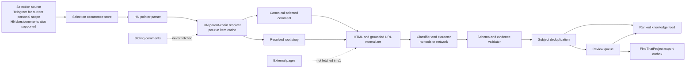

# Telegram HN Best Comments: Research and Standalone Project Plan

Status: research and proposed implementation plan; no production implementation has begun.

Research date: 2026-08-24  
Timezone: Europe/Moscow  
Source channel: [HN Best Comments](https://t.me/hn_best_comments)  
Repository relationship: this is intended to become a new, independently deployable project, not merely another Telegram source inside FindThatProject.

## Personal-use scope assumption

The planned system is a private, single-user research tool. It is not intended to be publicly deployed, monetized, or offered to third parties. Legal or permission resolution is therefore not a Phase 0 project blocker, per the project owner's direction.

Telegram's published [API Terms](https://core.telegram.org/api/terms) and [Content Licensing/AI terms](https://telegram.org/tos/content-licensing) do not contain an explicit personal-use exception for their AI-related restrictions. This fact is preserved here for future context, but the owner accepts responsibility for source-platform terms under the current personal-use scope. Any future public, commercial, or multi-user deployment should revisit this assumption.

## Executive conclusion

Build this as a provenance-first technical knowledge feed centered on selected Hacker News comments, not as a project directory and not as another Telegram adapter for FindThatProject.

The current 100-message sample produced:

- 13 Discoveries
- 22 Expert notes
- 63 Rejected comments

Those labels are mutually exclusive at the canonical-comment level and total 98 unique comments. Expert notes are therefore the larger retained class. A discovery-only product would discard most of the durable value.

The strongest product proposition is:

> Turn ephemeral, high-signal HN comments into a searchable technical commentary library, with projects and resources linked as subjects and every extracted claim traceable to the selected comment or root story.

Recommended product shape:

- Selected HN comments are first-class content.
- Expert notes are first-class reading objects.
- Discoveries are structured subjects linked to supporting comments.
- Root stories provide context, not primary content.
- Subject pages accumulate commentary without allowing comments to overwrite canonical project descriptions.
- FindThatProject receives only approved, URL-grounded, high-confidence Discoveries.

## Verified sample methodology

### Sampling window

- Channel: `@hn_best_comments`
- Sampling date: 2026-08-24, Europe/Moscow
- Frozen newest visible message: 32946
- Consecutive range: 32847-32946 inclusive
- Telegram time span:
  - First: 2026-08-19 15:05 UTC / 18:05 Moscow
  - Last: 2026-08-23 22:05 UTC / 2026-08-24 01:05 Moscow
- Missing Telegram IDs in the range: zero

The five public pages used were:

- [`before=32947`](https://t.me/s/hn_best_comments?before=32947)
- [`before=32927`](https://t.me/s/hn_best_comments?before=32927)
- [`before=32907`](https://t.me/s/hn_best_comments?before=32907)
- [`before=32887`](https://t.me/s/hn_best_comments?before=32887)
- [`before=32867`](https://t.me/s/hn_best_comments?before=32867)

### Resolution procedure

For every message:

1. Parse its Telegram message ID, timestamp, text, link entities, and multipart marker.
2. Treat the trailing HN `item?id=...` link as the selected-comment candidate.
3. Fetch that exact item from the official HN Firebase API.
4. Verify that it is a `comment`.
5. Follow only its `parent` field until an item with no parent is reached.
6. Require the terminal item to be the root story.
7. Never read `kids` or request sibling comments.
8. Cache every HN item by ID within the run.
9. Parse the selected comment's current HN HTML into canonical HTML, normalized plain text, and grounded anchor URLs.

The official HN API documents `parent`, `deleted`, `dead`, HTML `text`, and unique item IDs; it also notes that clients must tolerate optional or additional fields. See the [official HN API documentation](https://github.com/HackerNews/API/blob/master/README.md).

All 100 Telegram messages had exactly two HN `item` links and all 100 trailing links resolved to comments.

### Request accounting

Across 98 unique selected comments:

- 72 parent chains contained two items: comment to story.
- 22 contained three items.
- 4 contained four items.
- 163 distinct HN items were fetched after per-run caching.
- No transient HN failures occurred.
- No HN item request returned `null`.

## Aggregate measurements

### Core results

| Measurement | Result |
|---|---:|
| Telegram messages | 100 |
| Unique selected HN comments | 98 |
| Displayed Telegram story-reference IDs | 57 |
| Actual parent-chain root stories | 55 |
| Multipart groups | 2 |
| Telegram messages belonging to multipart groups | 4 |
| Repeated comments beyond multipart copies | 0 |
| Unique comments with explicit non-HN HN anchors | 11 |
| Distinct grounded non-HN destinations | 21 |
| Telegram messages whose rendered HTML contains an external anchor | 13 |
| Flagged selected comments | 1 |
| Deleted or dead selected comments | 0 |
| Missing HN items | 0 |
| Detectable content drift between Telegram snapshot and current HN text | 0 |

### Correction of the previous observations

| Previous hypothesis | Verified finding |
|---|---|
| 100 messages | Confirmed |
| 98 unique comments | Confirmed |
| 57 root stories | Correct only for displayed Telegram story references; there are 55 actual roots after walking HN parent chains |
| Two multipart comments | Confirmed |
| 13 comments with non-HN links | 13 Telegram messages have rendered external anchors, but only 11 canonical HN comments contain explicit external links |
| Heavy root repetition | Confirmed |

The difference between 57 and 55 is not rounding or parser behavior:

- [Telegram 32896](https://t.me/hn_best_comments/32896) references dead story `49385994`, while selected comment `49388070` now resolves to root `49383026`.
- Telegram messages [32912](https://t.me/hn_best_comments/32912), [32914](https://t.me/hn_best_comments/32914), [32915](https://t.me/hn_best_comments/32915), and [32916](https://t.me/hn_best_comments/32916) reference dead story `49398304`, while their selected comments resolve to root `49397074`.

This is consistent with HN duplicate-story merging or comment reparenting. The architecture must store both:

- `telegram_referenced_story_id`
- `current_resolved_root_story_id`

It must never assume they are equal.

The link-count difference comes from Telegram auto-linkification. It created anchors for plain text such as `OpenStreetMap.org`, `AGENTS.md`, and a bare `crates.io`, even when those were not explicit anchors in the HN comment. A URL extractor based only on Telegram-rendered links would therefore produce false destinations such as `http://AGENTS.md/`.

### Root-story repetition

Using unique selected comments rather than Telegram parts:

| Selected comments per root | Number of roots | Total comments |
|---:|---:|---:|
| 1 | 36 | 36 |
| 2 | 11 | 22 |
| 3 | 4 | 12 |
| 4 | 2 | 8 |
| 10 | 2 | 20 |

The two ten-comment roots were:

- "Felony charges for citizen deleting phone data at US Border"
- "Canada will match US tariffs 'dollar for dollar' as trade talks break down"

Thus, two stories generated 20.4% of the 98 canonical comments.

### Comment-length distribution

Canonical unique-comment plain-text lengths:

| Statistic | Characters | Approx. words |
|---|---:|---:|
| Minimum | 9 | 1 |
| P25 | 233 | 40 |
| Median | 439 | 78 |
| P75 | 726 | 125 |
| P90 | 1,088 | 192 |
| P95 | 1,420 | 250 |
| Maximum | 3,293 | 662 |
| Mean | 569 | 102 |

Two comments exceeded 2,000 characters. They were exactly the two multipart groups.

### Multipart observations

The groups were:

- HN comment `49369163`: Telegram [32863](https://t.me/hn_best_comments/32863) `[1/2]` and [32864](https://t.me/hn_best_comments/32864) `[2/2]`
- HN comment `49370357`: Telegram [32878](https://t.me/hn_best_comments/32878) `[1/2]` and [32879](https://t.me/hn_best_comments/32879) `[2/2]`

Concatenating the Telegram fragments reproduced current HN text exactly after whitespace normalization.

The channel's [public source](https://github.com/border-radius/hn-best-comments/blob/master/hn.js) explains the behavior: comments whose raw HTML exceeds 3,000 characters are split on paragraph boundaries and marked `[part/total]`.

### Story formats

Among the 55 resolved roots:

- 55 had a story URL.
- 10 also had non-empty HN `text`.
- 1 was a Show HN.
- 0 were Ask HN.
- 0 were pure text-only stories.

A targeted out-of-window check confirmed that the channel does carry Ask HN and text stories: [Telegram 32835](https://t.me/hn_best_comments/32835) contains selected comment [49332666](https://news.ycombinator.com/item?id=49332666), whose parent chain terminates at text-only Ask HN story `49332495`.

The sample's Show HN example is [Telegram 32892](https://t.me/hn_best_comments/32892), selected comment [49380334](https://news.ycombinator.com/item?id=49380334), root story `49378768`.

### Availability and edit behavior

- One selected comment was currently `[flagged]`: [Telegram 32873](https://t.me/hn_best_comments/32873), [HN 49361132](https://news.ycombinator.com/item?id=49361132).
- No selected comment had `dead:true` or `deleted:true`.
- Two distinct story references were dead duplicates, affecting five Telegram messages.
- All 96 non-multipart Telegram comment bodies matched current HN text after whitespace normalization.
- Both reconstructed multipart bodies also matched.
- HN does not expose a comment edit timestamp through this API, so future edit detection should compare stored content hashes on refetch.

## Manual classification

The 98 canonical comments were assigned one conservative primary label:

| Primary class | Unique comments | Share |
|---|---:|---:|
| Discovery | 13 | 13.3% |
| Expert note | 22 | 22.4% |
| Rejected | 63 | 64.3% |

At the Telegram-message level, Expert notes occupy 24 messages because both multipart comments are Expert notes.

A Discovery may still carry useful commentary. "Primary" means the comment's principal retained value is a named project, product, feature, guide, or resource. The domain model should allow it to produce both a Discovery and an attached Expert note.

### Representative examples

| Class | Example | Evidence origin | Judgment |
|---|---|---|---|
| Discovery | [Hister Telegram](https://t.me/hn_best_comments/32944) / [HN comment](https://news.ycombinator.com/item?id=49402473) | BOTH | Author identifies the project, repository, demo, operation modes, search types, CLI, web UI, and MCP endpoint. Strong retain. |
| Discovery | [Milktea Telegram](https://t.me/hn_best_comments/32928) / [HN comment](https://news.ycombinator.com/item?id=49401179) | COMMENT | Introduces a directly linked TUI framework and explains its design motivation. |
| Discovery | [Kagi Telegram](https://t.me/hn_best_comments/32897) / [HN comment](https://news.ycombinator.com/item?id=49388910) | BOTH | Root supplies the paywall-filter feature; comment supplies real product experience with Kagi's assistant. |
| Discovery | [Go 1.27 Telegram](https://t.me/hn_best_comments/32877) / [HN comment](https://news.ycombinator.com/item?id=49366580) | COMMENT | Identifies an otherwise omitted floating-point parsing feature and links both the algorithm explanation and implementation. |
| Expert note | [Printer-driver correction](https://t.me/hn_best_comments/32853) / [HN comment](https://news.ycombinator.com/item?id=49353104) | COMMENT | Corrects "Claude wrote a driver," explains that it bridges an existing Linux driver, and identifies a root-launcher risk. |
| Expert note | [GrapheneOS multipart note](https://t.me/hn_best_comments/32863) / [HN comment](https://news.ycombinator.com/item?id=49369163) | BOTH | Substantive maintainer account of AOSP publishing changes, operational delays, GPL concerns, and device strategy. |
| Expert note | [fMRI correction](https://t.me/hn_best_comments/32881) / [HN comment](https://news.ycombinator.com/item?id=49379412) | COMMENT | Explains why decreased activity does not establish harm and links the underlying study and comparison literature. |
| Expert note | [Android head-unit malware](https://t.me/hn_best_comments/32940) / [HN comment](https://news.ycombinator.com/item?id=49409002) | COMMENT | Corrects the malware's delivery and scope, distinguishes Android Auto, and provides an architectural comparison. |
| Rejected | [Flagged comment](https://t.me/hn_best_comments/32873) / [HN comment](https://news.ycombinator.com/item?id=49361132) | COMMENT | No recoverable substantive content. |
| Rejected | [Political one-liner](https://t.me/hn_best_comments/32920) / [HN comment](https://news.ycombinator.com/item?id=49397823) | COMMENT | Political assertion with no usable technical subject. |
| Rejected | [Naming joke](https://t.me/hn_best_comments/32939) / [HN comment](https://news.ycombinator.com/item?id=49401913) | COMMENT | Joke only; root project context must not make it relevant. |
| Rejected | [AliExpress reaction](https://t.me/hn_best_comments/32868) / [HN comment](https://news.ycombinator.com/item?id=49372995) | COMMENT | One-line reaction without explanation, experience, or reusable information. |
| Rejected | [Personal family reaction](https://t.me/hn_best_comments/32849) / [HN comment](https://news.ycombinator.com/item?id=49357415) | COMMENT | Meaningful personally, but unrelated to a usable technical subject. |

## Product scope

### Recommended proposition

The product should be a combination of:

1. A technical knowledge feed, as the primary product.
2. An expert-commentary reader, as its strongest content format.
3. A discovery engine, as a structured secondary view.

Suggested navigation:

- Latest technical notes
- Discoveries
- Subjects and projects
- Story clusters
- Security and operations
- Corrections and caveats

### First-class entities

Store these independently:

- Selected comment
- Root story
- Telegram or selection occurrence
- Subject
- Discovery
- Expert note
- Evidence span
- Grounded URL
- Classification decision
- Review task
- Export record

The selected comment is the central source object. Telegram messages are occurrences and provenance, and the root story is supporting context.

### Discoveries and Expert notes

They should have a many-to-many relationship:

- One comment may introduce several subjects.
- One subject may accumulate notes from multiple comments.
- A note may discuss several subjects.
- A Discovery records that a subject was identified from particular evidence.
- An Expert note records a durable explanation, correction, comparison, or experience.

A note may enrich a subject page with:

- caveats;
- experience;
- comparisons;
- operational details;
- corrections;
- security observations.

It must not automatically replace the subject's canonical description, canonical URL, or official positioning.

### Ranking and story diversity

Rank canonical notes and discoveries, never Telegram messages.

Recommended rules:

- Collapse multipart messages before ranking.
- Root-story-only discoveries appear once per `(root_story_id, subject_id)`.
- Aggregate repeated evidence into confidence rather than creating duplicate cards.
- Hard cap: no more than two items from one root story in the first 20 feed positions.
- Additional same-story notes remain behind an expandable story cluster.
- Apply a story saturation factor such as `1 / sqrt(1 + prior_items_from_story)`.
- Distinct comment-origin discoveries remain eligible if they introduce genuinely different subjects.

### Human review

Mandatory review should cover:

- FindThatProject exports.
- Missing or ambiguous canonical URLs.
- Subject merges based only on normalized names.
- Root-story-only discoveries.
- Legal, medical, or security recommendations.
- Destructive or evasion-oriented technical advice.
- Low-confidence classifications.
- Prompt-injection signals.
- Flagged or deleted content.
- Telegram and HN content divergence.
- Conflicting evidence origins.

### FindThatProject export

Export only a Discovery that satisfies all of:

- `status = APPROVED`
- grounded canonical HTTP(S) URL
- explicit subject type
- classification confidence at least 0.95
- URL and subject confidence at least 0.95
- selected comment materially discusses the subject
- no unresolved review flags
- evidence origin present
- human approval during initial rollout

Do not export Expert notes in v1. A later contract may include note excerpts as supplemental `evidence` or `caveats`, but they must never overwrite FindThatProject's canonical description.

### Explicit v1 non-goals

- Crawling sibling HN comments.
- Fetching or summarizing arbitrary external pages.
- Indexing arbitrary Telegram channels.
- Treating the Telegram administrator as the comment author.
- Generating ungrounded URLs.
- Automatically publishing high-stakes legal or security advice.
- Personalization or recommendation profiles.
- User comments, voting, or social features.
- Reconstructing deleted HN bodies from third-party archives.
- Replacing official project descriptions with comment summaries.
- Exporting generic root-story projects when the selected comment is irrelevant.

## Architecture and data flow



### Selection ingestion

A `SelectionSource` interface supports:

- `TelegramMtprotoSource`, enabled for the current personal-use scope.
- `HnBestCommentsSource`, as an independent upstream-compatible option.
- `FixtureSource`, for tests and evaluation.

For Telegram history:

- Use official MTProto history APIs; `messages.getHistory` supports bounded `min_id`, `max_id`, offsets, and limits. See the [Telegram history API](https://core.telegram.org/method/messages.getHistory).
- Use specific-ID requests to reconcile gaps and deletions.
- Select and contract-test a maintained Node.js/TypeScript MTProto client during implementation. Keep it behind `SelectionSource` so the library can be replaced without changing the ingestion pipeline.
- Do not rely on Bot API history for backfill: Bot API updates are transient and are retained for no more than 24 hours. See the [Telegram Bot API](https://core.telegram.org/bots/api).
- Keep the authenticated session local and encrypted or otherwise access-controlled.

### HN pointer parsing

Extract roles separately:

- `DISPLAYED_STORY_REFERENCE`
- `SELECTED_COMMENT`
- `INLINE_HN_REFERENCE`

Never label the first HN link as the root without parent-chain verification.

### HN resolver

For each selected comment:

```text
cursor = selected_comment_id
while true:
    item = run_cache.get_or_fetch(cursor)
    if request failed transiently: defer
    if response is null: mark MISSING_HN_ITEM
    append item to chain
    if item.parent is absent:
        require item.type in {"story", "poll"}
        resolved_root = item
        stop
    cursor = item.parent
```

Properties:

- No access to `kids`.
- No sibling traversal.
- Cycle and maximum-depth guard, suggested depth 64.
- Each item requested at most once per run.
- Persist raw response hash and normalized representation.
- Store the entire resolved ID path for provenance.

### Canonical reconstruction

Canonical content comes from the HN comment, not Telegram fragments.

Telegram multipart fragments are retained as provenance snapshots only. Reconstruction logic:

1. Group parts by canonical comment ID where available.
2. Validate common displayed story reference and selected-comment link.
3. Validate markers `1..N`, identical totals, adjacent or near-adjacent message IDs.
4. If all parts exist, compare normalized concatenated snapshot against HN canonical text.
5. If a part is absent, use the HN comment as canonical but mark the occurrence group `INCOMPLETE_SNAPSHOT`.
6. Never concatenate messages solely because they are adjacent.

### Structured classification

Run two conceptual passes within one strict request:

1. Decide whether the selected comment contains useful technical material.
2. Extract Discoveries and/or an Expert note, using the root only as bounded context.

The classifier receives no tools, filesystem, network, or arbitrary URL-fetch capability.

### Grounding and deduplication

URLs may come only from:

- HN comment anchor `href` values.
- Root story `url`.
- Root-story text anchor `href` values.
- Deterministically generated HN item permalinks.

The classifier returns URL candidate IDs, never URL strings.

### Review and serving

- Public or local-reader APIs serve only approved or policy-auto-approved material.
- Review operations are authenticated or restricted to the local user.
- Export uses an outbox table and idempotent consumer offsets.

## Domain model and storage schema

### Core tables

| Table | Important fields and constraints |
|---|---|
| `ingestion_runs` | Source, mode, requested ID range, cursor, start and end time, code version, status, counts, failure summary |
| `selection_occurrences` | Source, channel or source key, external message ID, timestamp, edit timestamp, content hash, status; unique `(source, source_key, external_id)` |
| `telegram_messages` | Occurrence ID, message entities, displayed text hash, optional short-retention snapshot, deletion state |
| `hn_references` | Occurrence ID, HN item ID, role, entity position, parse confidence |
| `hn_items` | HN ID PK, type, parent ID, author, time, title, HTML and text, URL, deleted, dead, availability, fetched time, response hash |
| `resolution_paths` | Selected comment ID, ordered ancestor IDs, displayed story ID, resolved root ID, resolver version |
| `selected_comments` | HN comment ID PK, root ID, canonical HTML and plain text, content hash, first and last seen, availability |
| `multipart_groups` | Stable group ID, comment ID, expected parts, reconstruction state, canonical source |
| `multipart_parts` | Group ID, occurrence ID, part number, observed total, fragment hash; unique `(group_id, part_no)` |
| `url_candidates` | Raw URL, canonical URL, source document, origin field, scheme and host, validation state, content hash |
| `classification_runs` | Comment ID, model and config ID, prompt and schema version, input hash, output JSON, latency, token counts, status |
| `content_decisions` | Comment ID, primary class, confidence, rejection reasons, manual override, active classification run |
| `subjects` | Kind, normalized name, aliases, canonical URL ID, dedup key, lifecycle state |
| `subject_mentions` | Subject ID, comment or root source, evidence origin, evidence span IDs, confidence |
| `discoveries` | Subject ID, selected comment ID, evidence origin, confidence, status, extraction version |
| `expert_notes` | Selected comment ID, note type, title, summary, confidence, publication and review status |
| `expert_note_subjects` | Many-to-many join between notes and subjects |
| `evidence_spans` | Entity and field path, source document, start and end offsets, quoted-text hash |
| `review_tasks` | Entity reference, reason codes, priority, state, assignee, resolution |
| `export_outbox` | Destination, discovery ID, revision, payload, idempotency key, delivery state |

### Important distinctions

- `displayed_story_id` and `resolved_root_id` must be separate.
- A Telegram message and a selected comment are not the same entity.
- A multipart group has several occurrences but exactly one canonical comment.
- A root story may be reparented, merged, dead, or different from the displayed reference.
- Classifier outputs are append-only runs; the active decision points at one run or a manual override.
- Evidence origin belongs on every discovery or mention, not only the overall comment.

## Classifier output schema

A provider-neutral logical schema:

```json
{
  "schema_version": "classification.v1",
  "primary_decision": "DISCOVERY | EXPERT_NOTE | REJECTED | REVIEW",
  "decision_confidence": 0.0,
  "comment_relevance": {
    "is_materially_technical": true,
    "reason": "bounded string",
    "evidence_span_ids": ["comment:120-245"]
  },
  "rejection_reasons": [
    "POLITICS_NO_TECHNICAL_SUBJECT",
    "JOKE_OR_ONE_LINER",
    "GENERIC_OPINION",
    "PERSONAL_STORY_NO_USABLE_SUBJECT",
    "INCIDENTAL_MENTION",
    "NEWS_WITHOUT_REUSABLE_DETAIL",
    "UNAVAILABLE_CONTENT"
  ],
  "discoveries": [
    {
      "subject_type": "PROJECT | TOOL | LIBRARY | SERVICE | PRODUCT | FEATURE | PLUGIN | AGENT_SKILL | GUIDE | RESOURCE",
      "name": "bounded string",
      "aliases": ["bounded string"],
      "description_claim": "bounded evidence-based summary",
      "evidence_origin": "COMMENT | ROOT_STORY | BOTH",
      "evidence_span_ids": ["comment:20-180", "root:title"],
      "url_candidate_ids": ["url:3"],
      "url_grounding": "GROUNDED | NONE",
      "root_story_only": false,
      "confidence": 0.0
    }
  ],
  "expert_note": {
    "note_type": "TECHNICAL_EXPLANATION | CORRECTION | PRODUCT_EXPERIENCE | IMPLEMENTATION_CAVEAT | SECURITY | OPERATIONS | COMPARISON | GUIDE",
    "title": "bounded string",
    "summary": "bounded evidence-based summary",
    "evidence_span_ids": ["comment:0-400"],
    "related_subject_names": ["bounded string"],
    "qualifiers": ["anecdotal", "requires legal review"],
    "confidence": 0.0
  },
  "review": {
    "required": false,
    "reasons": []
  }
}
```

Post-schema validation must reject output when:

- A returned URL ID was not supplied in the input.
- An evidence span does not reproduce source text.
- `ROOT_STORY` evidence is claimed without a root span.
- `BOTH` lacks spans from both sources.
- The comment is irrelevant but a generic root creates a Discovery.
- `REJECTED` contains discoveries or an Expert note.
- A subject name has no supporting span.
- Output exceeds configured field lengths.
- An origin enum or note type is unknown.

## Deduplication algorithms

### Telegram occurrence

Identity:

```text
(source, source_key, external_message_id)
```

Upserts may update edit timestamps and content hashes but never create a second occurrence.

### Canonical selected comment

Identity:

```text
hn_comment_id
```

Multipart posts, reposts, or alternate ingestion sources all converge here.

### Root story

Identity:

```text
current_parent_chain_root_hn_id
```

The displayed Telegram story ID remains provenance, not identity.

### Multipart

Preferred identity:

```text
hn_comment_id
```

Provisional identity before comment resolution:

```text
hash(
  source_key,
  normalized_displayed_story_reference,
  selected_comment_reference,
  observed_total_parts
)
```

Require:

- same selected-comment ID;
- same total;
- unique part numbers;
- bounded message-ID distance;
- compatible timestamps.

### Subject

Priority order:

1. Ecosystem coordinate, such as GitHub owner and repository or package coordinate.
2. Canonical normalized URL.
3. Verified official product domain.
4. Normalized `(name, subject_type, disambiguating root/domain)`.

Name-only matches create review suggestions, not automatic merges.

### Root-story-only discoveries

Identity:

```text
(resolved_root_story_id, subject_dedup_key, extraction_version)
```

Multiple selected comments add evidence edges to the same Discovery. They do not create multiple project cards.

## Failure handling, security, and privacy

### Retry and state policy

| Condition | Handling |
|---|---|
| Telegram flood wait | Honor exact server wait when below configured ceiling; otherwise defer run |
| Telegram timeout or 5xx | Three retries with exponential backoff and jitter |
| Telegram inaccessible or private | Terminal `SOURCE_UNAVAILABLE` |
| HN timeout, 429, or 5xx | Three retries; state `HN_RETRYABLE` |
| HN HTTP 200 with `null` | Refetch after delay; then `HN_MISSING` |
| HN `deleted:true` or `dead:true` | Successful resolution with tombstone state, not a request failure |
| Incomplete multipart group | `AWAITING_PARTS`, then `INCOMPLETE_SNAPSHOT`; canonical HN text may still proceed |
| Invalid classifier JSON | One repair-free retry; then review or error |
| Unsupported URL scheme | Reject candidate |
| Evidence mismatch | Reject extraction and enqueue review |
| Database uniqueness conflict | Idempotent reread and continue |

### Input limits

Suggested initial limits:

- Comment HTML: 24 KiB
- Root text HTML: 16 KiB
- Root title: 512 characters
- URL candidates: 50
- URL length: 2,048 characters
- Parent depth: 64
- Total classifier input: 32 KiB after normalization
- Classifier timeout: 45 seconds
- HN request timeout: 10 seconds
- Telegram request timeout: 15 seconds

Oversized content should be deterministically truncated with a stored truncation map. Never silently truncate evidence spans.

### Prompt-injection protection

- Treat all source text as untrusted quoted data.
- Use system instructions stating that embedded instructions are content, not commands.
- Give the classifier no tools, shell, browser, filesystem, credentials, or network.
- Use strict JSON Schema with `additionalProperties: false`.
- Validate every evidence span and URL candidate after inference.
- Never follow instructions embedded in comments.
- Add adversarial fixtures containing fake system messages, JSON closers, tool requests, and URL-invention requests.
- Record injection indicators as review metadata without exposing them in logs.

### HTML and URL safety

- Sanitize HN HTML with an allowlist.
- Permit only `http` and `https` outbound links.
- Render external links with `noopener`, `noreferrer`, and `nofollow`.
- Preserve original and canonical URL separately.
- Remove known tracking parameters only from the canonical form.
- Do not treat Telegram auto-linkification as authoritative.

### External fetching

Do not fetch external pages in v1.

If later justified for official-name or availability verification, isolate it behind:

- dedicated egress service;
- no cookies or authentication;
- private or reserved IP blocking before and after every redirect;
- maximum three redirects;
- two-megabyte response limit;
- five-second connect and ten-second total timeout;
- content-type allowlist;
- no JavaScript execution;
- robots and licensing review;
- per-domain rate limits;
- audit logging without body content.

### Privacy and retention

- Store HN handles only for attribution.
- Do not ingest Telegram subscribers, reactions, or viewer identities.
- Avoid unnecessary long-term Telegram body storage; retain IDs, hashes, and link entities where possible.
- If HN later marks a comment deleted, remove its body from serving and retain only ID, status, and non-reversible provenance hashes.
- Never log full comment text, prompt bodies, credentials, session strings, or URL query values.
- Encrypt or locally protect Telegram session credentials.

## API and export contract

### Reader API

Suggested endpoints:

```text
GET /v1/feed?kind=discovery|expert_note&cursor=...
GET /v1/comments/{hn_comment_id}
GET /v1/stories/{hn_story_id}
GET /v1/subjects/{subject_id}
GET /v1/subjects/{subject_id}/notes
```

### Review API

```text
GET  /v1/review/tasks
POST /v1/review/tasks/{id}/approve
POST /v1/review/tasks/{id}/reject
POST /v1/review/tasks/{id}/merge-subject
POST /v1/review/tasks/{id}/resolve-url
```

### FindThatProject export

Use a pull-based, versioned outbox:

```json
{
  "schema_version": "findthatproject.discovery.v1",
  "export_id": "immutable-id",
  "revision": 1,
  "discovery_id": "uuid",
  "subject": {
    "name": "Hister",
    "type": "PROJECT",
    "canonical_url": "https://github.com/asciimoo/hister",
    "evidence_based_summary": "Personal full-text and semantic search index"
  },
  "provenance": {
    "hn_comment_id": 49402473,
    "hn_root_story_id": 49351802,
    "telegram_message_ids": [32944],
    "evidence_origin": "BOTH",
    "evidence_quote": "bounded excerpt"
  },
  "confidence": 0.98,
  "reviewed_at": "timestamp"
}
```

Retractions and corrections should increment `revision`; consumers acknowledge by `export_id + revision`.

## Evaluation corpus and acceptance thresholds

### Corpus strategy

Use the current 98 canonical comments as the seed, then expand to at least 300 adjudicated comments:

- 100 recent consecutive selections.
- 100 older randomly sampled selections across several months.
- 100 targeted edge cases:
  - multipart;
  - dead or merged stories;
  - deleted and flagged comments;
  - Ask HN;
  - Show HN;
  - text-only stories;
  - no external links;
  - hidden or truncated anchors;
  - root-only subjects;
  - repeated stories;
  - security or legal material;
  - prompt-injection attempts.

Process:

1. Two independent annotators.
2. Primary class plus zero or more extractions.
3. Evidence spans and origin labels.
4. Adjudication of disagreements.
5. Keep 30% as a prompt-development holdout.
6. Target inter-annotator Cohen's kappa of at least 0.75 before model evaluation.

### Acceptance thresholds

| Capability | Threshold |
|---|---:|
| Selected-comment identification on accessible fixtures | 100% |
| Correct current root resolution | 100% |
| Sibling HN item requests | 0 |
| Multipart reconstruction | 100% |
| Missing versus transient state accuracy | 100% |
| Primary-class macro F1 | at least 0.85 |
| Discovery precision | at least 0.93 |
| Expert-note precision | at least 0.88 |
| URL-grounding precision | 100% |
| Invented URL rate | 0 |
| Evidence-origin accuracy | at least 0.97 |
| Evidence-span validation | 100% |
| Subject-dedup precision | at least 0.97 |
| Subject-dedup recall | at least 0.90 |
| FindThatProject export precision | at least 0.98 |
| Schema-valid classifier outputs | at least 99.5% |
| Adversarial prompt causing tool or network action | 0 |
| Same-root items in first 20 feed positions | at most 2 |
| Pipeline p95, excluding deferred upstream failures | under 60 seconds per comment |

During the initial export rollout, require zero false-positive exports in the reviewed holdout before enabling automatic outbox insertion.

## Engineering implementation plan

### Preferred technology stack

| Area | Preferred choice | Notes |
|---|---|---|
| Frontend, if added later | Vite, React, TypeScript, Tailwind CSS, shadcn/ui | Keep the backend usable without a frontend. Initialize shadcn/ui only when `apps/web` is created. |
| Runtime | Node.js, current Active LTS pinned per release | Prefer the conservative Railway path. Use Node.js rather than Bun initially. |
| Language | TypeScript | Share domain types and API contracts across the API, worker, and future frontend. |
| API | Hono with the Node.js adapter | Hono remains portable while its official Node adapter gives a conventional Node deployment. |
| Database | PostgreSQL | Use Railway-managed PostgreSQL in hosted environments and Docker Compose locally. |
| ORM and migrations | Prisma | Keep schema and migrations in the shared database package. |
| Background processing | Separate Node.js worker backed by PostgreSQL jobs | Redis is unnecessary for v1. |
| Packaging | Docker | Use one reproducible application image with distinct API and worker start commands. |
| Deployment | Railway | Deploy PostgreSQL, API, and worker as separate services; add a web service only if the frontend is built. |

### Runtime decision: Node.js, not Bun

Use Node.js for the initial implementation. Railway supports Node.js through its normal build path and publishes a dedicated [Hono deployment guide](https://docs.railway.com/guides/hono). Hono supports Node through `@hono/node-server`, while [Prisma Client supports Node.js](https://www.prisma.io/docs/orm/prisma-client).

Bun was evaluated but is not the preferred runtime. Railway can deploy it, but Railway's current [Bun guide](https://docs.railway.com/guides/bun) says that Railpack does not yet detect Bun projects automatically and therefore requires a Dockerfile. The project already intends to use Docker, but Node.js still has the lower compatibility risk across Prisma, the Telegram client, observability libraries, and deployment tooling. Bun can be reconsidered later only if it offers a measurable benefit and passes the same integration, migration, and production smoke tests.

Node.js deployment guardrails:

- Pin an Active LTS Node.js image version instead of using `latest`.
- Commit the package-manager lockfile and use a frozen, clean install such as `npm ci` in CI and Docker builds.
- Bind the Hono server to `0.0.0.0` and read Railway's injected `PORT`.
- Expose `/healthz` without an external dependency and add a deeper readiness check for PostgreSQL separately.
- Run `prisma migrate deploy` from exactly one Railway pre-deploy/release path, never concurrently from the API and worker.
- Use a multi-stage Docker build and run the final process as a non-root user.

### Railway service topology

1. **PostgreSQL:** Railway-managed database with `DATABASE_URL` provided to the application services.
2. **API:** Hono on Node.js, serving ingestion controls, review, feed, and export endpoints.
3. **Worker:** the same application image with a different command, processing the PostgreSQL-backed job queue.
4. **Scheduler:** begin with Railway cron or a small scheduler process only when periodic jobs are needed.
5. **Web, optional:** a separate Vite build and service added later; it must not be required for API or worker operation.

For the future frontend, keep `components.json` inside `apps/web`, install shadcn/ui components through its official CLI, preserve semantic design tokens, and keep reusable primitives under `src/components/ui`.

### Proposed repository layout

```text
package.json
package-lock.json
tsconfig.base.json
apps/
  api/
    package.json
    src/
      index.ts
      routes/
        health.ts
        ingestion.ts
        review.ts
        feed.ts
        export.ts
  worker/
    package.json
    src/
      index.ts
      jobs/
        sync.ts
        resolve.ts
        classify.ts
        reconcile.ts
  web/                         # optional, added later
    package.json
    components.json
    src/
      components/ui/
      lib/utils.ts
packages/
  domain/src/
    entities.ts
    enums.ts
    identities.ts
    policies.ts
  application/src/
    ingest.ts
    resolve-hn.ts
    reconstruct.ts
    normalize.ts
    classify.ts
    validate-output.ts
    deduplicate.ts
    rank.ts
    review.ts
    export.ts
  ports/src/
    selection-source.ts
    hn-items.ts
    classifier.ts
    repositories.ts
    clock.ts
  adapters/src/
    hn/
      firebase-client.ts
      best-comments-source.ts
      html-normalizer.ts
    telegram/
      mtproto-source.ts
      pointer-parser.ts
    classifier/
      client.ts
      input-builder.ts
      output-schema.ts
      prompts.ts
  db/
    package.json
    prisma/
      schema.prisma
      migrations/
    src/
      client.ts
      repositories.ts
      job-queue.ts
  contracts/src/
  config/src/
tests/
  unit/
  integration/
  contract/
  evaluation/
  fixtures/
Dockerfile
compose.yaml
railway.json
```

### Migration sequence

#### `0001_ingestion`

Create:

- `ingestion_runs`
- `selection_occurrences`
- `telegram_messages`
- `hn_references`
- source cursors

Acceptance:

- The same source message can be ingested repeatedly without duplication.
- An explicit 100-ID range is recorded reproducibly.

#### `0002_hn_resolution`

Create:

- `hn_items`
- `resolution_paths`
- `selected_comments`
- `multipart_groups`
- `multipart_parts`

Acceptance:

- All 98 accessible sample comments resolve.
- Five displayed-story and root mismatches remain preserved.
- No sibling request appears in the HTTP test log.
- Both multipart comments reconstruct.

#### `0003_classification`

Create:

- `classification_runs`
- `content_decisions`
- `evidence_spans`
- prompt and schema version indexes

Acceptance:

- Every output validates against the strict schema.
- Evidence spans reproduce source text.
- Rejected comments cannot contain extracted entities.

#### `0004_subjects_and_notes`

Create:

- `url_candidates`
- `subjects`
- `subject_mentions`
- `discoveries`
- `expert_notes`
- `expert_note_subjects`

Acceptance:

- Repeated root-only subjects collapse.
- Comment-origin projects remain distinct when genuinely different.
- URL IDs can be traced to an HN field or anchor.

#### `0005_review_and_export`

Create:

- `review_tasks`
- `export_outbox`
- manual override audit records

Acceptance:

- All export operations are idempotent.
- A retracted Discovery produces a new revision.
- Expert notes cannot enter the FindThatProject outbox.

### Required tests

#### Unit tests

- First Telegram story reference differs from actual root.
- Dead duplicate story handling.
- Top-level and nested comment chains.
- Cycle and depth guard.
- Per-run HN cache single-flight behavior.
- `null` HN response versus timeout.
- Deleted, dead, and flagged states.
- HTML entities, paragraphs, code blocks, and links.
- Telegram auto-link false positives such as `AGENTS.md`.
- Multipart ordering, duplicate parts, missing parts, and conflicting totals.
- URL normalization and unsafe schemes.
- Root-story relevance gate.
- Subject dedup keys.
- Story diversity cap.
- Prompt-injection fixtures.

#### Integration tests

- PostgreSQL uniqueness and transaction retry.
- Full fixture ingestion through classification.
- Review approval and rejection.
- Export outbox delivery and replay.
- HN live-contract smoke test, disabled by default in CI.
- Telegram contract smoke test using the local personal session.

#### Evaluation tests

- Frozen gold labels and evidence spans.
- Per-class metrics.
- Root-origin confusion matrix.
- URL invention assertion.
- Prompt and schema regression comparison by model and prompt version.

## Phased roadmap

### Phase 0: Product and taxonomy validation

- Confirm the private, personal-use scope.
- Finalize taxonomy using the 98-comment seed.
- Mock the feed and subject-page UX.
- Approve FindThatProject export policy.
- Decide whether Telegram or direct HN `/bestcomments` is the default selection adapter.

Exit criteria:

- Scope and source decision recorded.
- First-class entities agreed.
- Annotator guide complete.

### Phase 1: Deterministic ingestion

- Create standalone repository and migrations 0001-0002.
- Implement the selected source adapter.
- Implement resolver, cache, HTML normalization, multipart model, and provenance.
- Backfill the approved sample.

Exit criteria:

- Resolution and reconstruction thresholds met.
- Zero sibling requests.
- Five root mismatches reproduced correctly.

### Phase 2: Classification and review

- Implement migrations 0003-0004.
- Add strict classifier schema and deterministic validators.
- Add reviewer API and minimal reviewer UI.
- Run classifier in shadow mode.

Exit criteria:

- Discovery precision at least 0.93.
- Expert-note precision at least 0.88.
- URL invention rate zero.
- Review workload measured and acceptable.

### Phase 3: Knowledge feed

- Implement subject pages, note feed, story clustering, and ranking.
- Add deletion reconciliation and safe rendering.
- Add metrics and dashboards.

Exit criteria:

- Same-root cap verified.
- Reader objects have complete provenance.
- Deleted or flagged material is safely tombstoned.

### Phase 4: FindThatProject export

- Implement migration 0005 and versioned export endpoint.
- Manually review every export candidate.
- Run a non-mutating downstream contract test.

Exit criteria:

- Export precision at least 0.98.
- Idempotent replay and retraction verified.
- Downstream owner approves schema.

### Phase 5: Hardening and scale

- Expand the gold corpus to at least 300 comments.
- Add periodic HN content reconciliation.
- Add disaster recovery, backups, retention jobs, and load testing.
- Revisit source-platform assumptions if the project becomes public, commercial, or multi-user.

## Observability

Recommended metrics:

- `ingestion_messages_total`
- `ingestion_gap_total`
- `hn_resolution_depth`
- `hn_cache_hit_total`
- `displayed_root_mismatch_total`
- `multipart_incomplete_total`
- `classification_total{decision}`
- `classification_schema_error_total`
- `classification_latency_seconds`
- `url_candidate_rejected_total{reason}`
- `review_queue_depth`
- `review_queue_oldest_age_seconds`
- `feed_root_concentration`
- `export_total{status}`
- `pipeline_failure_total{stage,reason}`

Structured logs should contain IDs, stage names, states, durations, and hashes. They should not contain full source bodies, prompts, secrets, or unredacted URL query strings.

## Risks and unresolved decisions

1. Telegram's published AI-use restrictions should be reconsidered if the personal-use scope changes.
2. Full-comment storage and display policy needs an explicit retention and deletion decision.
3. HN roots can change after posting; historical displayed references and current roots must both be retained.
4. Discovery sparsity is real: only 13.3% of canonical comments were Discoveries.
5. Root repetition can swamp a feed unless diversity is enforced at serving time.
6. Anonymous product experiences are useful but unverified; preserve qualifiers and provenance.
7. Legal, medical, and security comments need stronger review even in a private reader.
8. Name-only subject merging is risky. NickelMenu, Plato, Ratatui, and historical 15.ai illustrate the need for URL resolution.
9. Model choice remains open and should be selected using the evaluation corpus rather than reputation alone.
10. The FindThatProject integration mechanism remains unresolved. The recommended default is a pull-based, versioned outbox.
11. The standalone project's final name remains unresolved.
12. The Node.js/TypeScript MTProto client remains to be selected through a focused contract test against bounded history, exact-ID reconciliation, session persistence, and Telegram flood-wait behavior.

## Current recommendation

Proceed with Phase 0 product and taxonomy validation, then build the deterministic ingestion and HN-resolution layers before introducing classification. Preserve the 100-message window as the first regression corpus. Keep the selected HN comment as the primary content, the resolved root as context, and every extracted subject or note tied to validated evidence spans.
